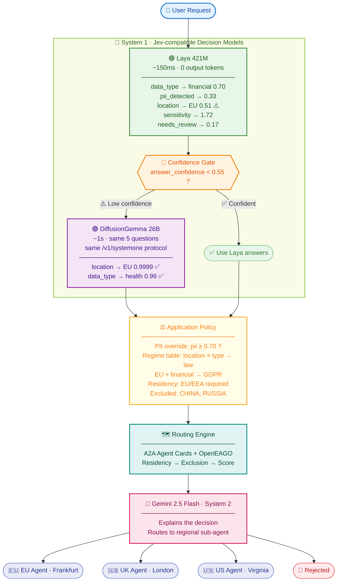

# Cross-Border Data Router

A compliance-aware data routing agent that combines **two Jev-compatible decision models** — Laya (fast) and DiffusionGemma (deep) — with **LLM reasoning** (Gemini) and a **deterministic policy engine**.

The key idea: Laya answers five typed questions in one forward pass (~150ms, zero generated tokens).  If its confidence is low, DiffusionGemma 26B is called automatically with the **same five questions** for a deeper read (~1s).  Both speak the Jev `/v1/systemone` protocol.  An application policy maps those calibrated probabilities to routing decisions.  Gemini explains the result.  The models provide the signal; the policy provides the decision.

## The Problem

Financial institutions processing data across borders face cascading regulatory requirements:

- **GDPR (EU)**: Personal data of EU residents cannot leave the EU/EEA without adequacy decisions.  Fines up to 4% of global annual revenue.
- **HIPAA (US)**: Protected health information must stay in approved jurisdictions.
- **CCPA (US)**: California consumers' personal data has transfer restrictions.
- **Conflicting obligations**: A German customer's health records may simultaneously require EU residency (GDPR), US reporting (FATCA), and contractual restrictions forbidding certain jurisdictions.

Current approaches fail because:
- **Manual classification** is slow, error-prone, and doesn't scale.
- **LLM-only classification** hallucinates categories, produces uncalibrated confidence, and takes seconds per request.

Neither provides **auditable probability distributions** that compliance teams need.

## How It Works



## Two Jev-compatible Models, One Protocol

Laya and DiffusionGemma are **not** Jev — they are separate open-source / research models that speak the same `POST /v1/systemone` wire protocol as TypeSafe's hosted Jev API.  Both return the same answer shapes (`choice`, `score`, `noul`) with calibrated probability distributions.  An existing Jev client just needs its `baseUrl` repointed.

| | Laya | DiffusionGemma |
|---|---|---|
| Parameters | 421M encoder | 26B (A4B active) |
| Architecture | Non-autoregressive | Diffusion transformer |
| Latency | ~150ms | ~1s |
| Output tokens | 0 | 10 |
| GPU | A10G | H200 MIG 3g.71gb |
| When called | Every request | Only when Laya's confidence < 0.55 |

## The Question Schema

The five questions are answered **simultaneously** in one forward pass by whichever model handles the request.  Each uses the right question type for its answer shape:

```python
COMPLIANCE_QUESTIONS = {
    "data_type": {                          # What kind of data?
        "type": "choice",
        "criteria": {
            "PII": "names, addresses, national IDs, tax IDs",
            "financial": "account numbers, transactions, invoices",
            "health": "diagnoses, treatment plans, insurance claims",
            "public": "non-sensitive public information",
        },
    },
    "pii_detected": {                       # Contains PII?
        "type": "noul",                     # Returns probability 0.0–1.0
    },
    "data_subject_location": {              # Where is the person?
        "type": "choice",
        "criteria": {"EU": "...", "UK": "...", "US": "...", "other": "..."},
    },
    "sensitivity": {                        # How sensitive?
        "type": "score",                    # Ordered scale 0–3
        "criteria": ["public", "internal", "confidential", "restricted"],
    },
    "needs_human_review": {                 # Ambiguous?
        "type": "noul",
    },
}
```

The probabilities are **calibrated** — when the model says 0.94, the true positive rate is approximately 94%.  This is what compliance requires: not "the AI said PII", but "94% probability of PII exceeding our 70% threshold".

## The Application Policy

The model reads the data.  The policy applies the law.  This separation is what makes the system auditable and adaptable:

```python
# The model tells us WHERE and WHAT.  The law tells us the rest.
_REGIME_TABLE = {
    ("EU", "PII"):    ("GDPR",    ["EU", "EEA"], ["US", "CHINA", "RUSSIA"]),
    ("EU", "health"): ("GDPR",    ["EU", "EEA"], ["US", "CHINA", "RUSSIA"]),
    ("UK", "PII"):    ("UK_GDPR", ["UK", "EU"],  ["CHINA", "RUSSIA"]),
    ("US", "health"): ("HIPAA",   ["US"],         ["CHINA", "RUSSIA"]),
    ("US", "PII"):    ("CCPA",    ["US"],         []),
    # ... swap the policy without retraining the model
}

# Tuneable thresholds — raise to be more conservative
PII_THRESHOLD        = 0.70   # above → treat as PII
REVIEW_THRESHOLD     = 0.60   # above → flag for human review
SENSITIVITY_FLOOR    = 2.5    # above → mandatory escalation
CONFIDENCE_FLOOR     = 0.50   # below → escalate for low confidence
```

When a regulation changes, update the table — no model retraining, no redeployment of inference services.

## Demo Scenarios

### 1. EU Health — DiffusionGemma Confirms

> "Route: Patient Maria Schmidt, Berlin. Diagnosis: Type 2 Diabetes. Prescription: Metformin 500mg."

| Question | Laya (150ms) | DiffusionGemma (1s) |
|---|---|---|
| data_type | health (0.93) | health (0.99) |
| pii_detected | 0.94 | 1.00 |
| location | EU (0.51) ⚠️ | EU (0.9999) ✓ |
| sensitivity | 2.49 | 2.49 |
| needs_review | 0.01 | 0.01 |

**Confidence gate triggered**: Laya's location confidence (0.51) was below the 0.55 gate, so DiffusionGemma was called with the same questions.  DiffusionGemma confirmed EU at 0.9999.  Total: ~800ms.

**Policy**: EU + health → GDPR → route to EU Agent.

### 2. US Health + PII Override — Laya Handles Alone

> "Route: Patient John Smith, SSN 123-45-6789. Medicare ID: 1EG4-TE5-MK72. Diagnosis: Hypertension. Dr. Williams, Mayo Clinic, Rochester MN."

| Question | Laya (158ms) |
|---|---|
| data_type | health (0.76) |
| pii_detected | 0.84 |
| location | US (0.57) ✓ |
| sensitivity | 1.57 |
| needs_review | 0.18 |

**No escalation**: Both data_type confidence (0.76) and location confidence (0.57) were above the 0.55 gate.  158ms.

**Policy**: pii_detected (0.84) ≥ 0.70 → PII override.  But original data_type was health → HIPAA still applies (not CCPA).  Route to US Agent.

### 3. UK Financial — DiffusionGemma Confirms Location

> "Route: Account holder James Wilson, London. Barclays sort code 20-71-04, account 41298756. GBP 15,340.00 pension transfer."

| Question | Laya (150ms) | DiffusionGemma (1s) |
|---|---|---|
| data_type | financial (0.93) | financial (0.9992) |
| pii_detected | 0.57 | 0.87 |
| location | other (0.46) ⚠️ | UK (0.9998) ✓ |
| sensitivity | 1.57 | 1.50 |
| needs_review | 0.21 | 0.01 |

**Confidence gate triggered**: Laya's location confidence (0.46) was below the 0.55 gate — it actually picked "other" instead of UK.  DiffusionGemma corrected to UK at 0.9998.  Total: ~800ms.

**Policy**: UK + financial → UK_GDPR.  pii_detected (0.87) ≥ 0.70 → PII override.  Route to UK Agent.

### 4. Public Data — No Restrictions

> "Route: Open-source project README: 'This library is MIT-licensed. Install with pip install example-lib.'"

| Question | Laya (143ms) |
|---|---|
| data_type | public (0.79) |
| pii_detected | 0.05 |
| location | other (0.79) |
| sensitivity | 0.80 |
| needs_review | 0.16 |

**No escalation**: Both confidences above 0.55 gate.  143ms.

**Policy**: No specific location + no PII → no regime → route anywhere.

## Setup

### Local Development

```bash
cd agent
cp .env.example .env
# Edit .env:
#   GOOGLE_API_KEY      — your Gemini key (https://aistudio.google.com/apikey)
#   LAYA_API_URL        — Laya endpoint (default provided)
#   DIFFUSIONGEMMA_API_URL — DiffusionGemma endpoint (default provided)
#   CONFIDENCE_GATE     — gate threshold (default 0.55)
uv sync
source .venv/bin/activate
uv run adk web .   # Opens ADK playground at http://localhost:8000
```

### Testing from the UI

There are two ways to interact with the agent through a browser:

**Option 1: ADK Playground** (recommended for development)

```bash
cd agent
uv run adk web .
```

Opens the Google ADK built-in playground at `http://localhost:8000`.  Shows the
full agent conversation with tool calls expanded — you can see each of the
pipeline steps: `classify_with_laya` (which may escalate to DiffusionGemma) →
`apply_compliance_policy` → `evaluate_and_route` → sub-agent.

**Option 2: Custom Playground** (deployed endpoint)

```bash
cd agent
uv run uvicorn main:app --host 0.0.0.0 --port 8080
```

Opens the custom chat UI at `http://localhost:8080`.  This is the same UI
served when the agent is deployed to OpenShift.  It shows tool calls and
tool responses as styled cards alongside the agent's final answer.

**Try these example prompts** (click the buttons in the UI or paste):

1. **EU Health** → GDPR routing, DiffusionGemma escalation:
   > Classify and route: Patient Maria Schmidt, Berlin. Diagnosis: Type 2 Diabetes. Prescription: Metformin 500mg.

2. **US Health** → HIPAA + PII override, Laya handles alone:
   > Classify and route: Patient John Smith, SSN 123-45-6789. Medicare ID: 1EG4-TE5-MK72. Diagnosis: Hypertension. Dr. Williams, Mayo Clinic, Rochester MN.

3. **UK Financial** → UK GDPR, DiffusionGemma corrects location:
   > Classify and route: Account holder James Wilson, London. Barclays sort code 20-71-04, account 41298756. GBP 15,340.00 pension transfer.

4. **Public data** → no restrictions:
   > Classify and route: Open-source project README: 'This library is MIT-licensed. Install with pip install example-lib.'

### OpenShift Deployment

```bash
# Create secrets
oc create secret generic gemini-apikey -n laya-demo \
  --from-literal=api_key=<YOUR_GEMINI_KEY>

# Build the agent image
oc new-build --binary --name=cbdr-agent -n laya-demo
cd agent && oc start-build cbdr-agent --from-dir=. -n laya-demo --follow

# Deploy
oc apply -f manifests/06-agent.yaml
```

## Project Structure

```
agent/
├── app/
│   ├── agent.py                # Root agent — Gemini + decision models + policy + routing
│   ├── model.py                # Gemini model configuration
│   ├── prompt.py               # Orchestrator instructions (confidence gate + 4-step pipeline)
│   ├── policy/                 # Deterministic routing engine
│   │   ├── cards.py            # A2A Agent Cards with OpenEAGO metadata
│   │   ├── engine.py           # Three-stage routing (residency → exclusion → score)
│   │   └── models.py           # DataRequest, RoutingDecision
│   ├── sub_agents/             # Regional processor agents (EU, UK, US)
│   └── tools/
│       ├── laya_tool.py        # Jev-compatible — Laya fast + DiffusionGemma deep (confidence gated)
│       ├── compliance_policy.py # Application policy — maps probabilities to decisions
│       └── routing_tool.py     # Policy engine tool wrapper
├── tests/
│   └── unit/
│       ├── test_compliance_policy.py  # 13 policy rule tests
│       └── test_tools.py              # Routing tool + sub-agent tests
├── Dockerfile
└── pyproject.toml
```

## Key Design Decisions

1. **Two Jev-compatible models, one protocol — Laya for speed, DiffusionGemma for depth.**
   Both speak `POST /v1/systemone` and answer the same five typed questions.  Laya runs first (~150ms).  If its `answer_confidence` on data_type or data_subject_location falls below the gate (0.55), DiffusionGemma 26B is called with the same questions for a deeper read (~1s).  This follows the confidence gating pattern from Laya Example 18.

2. **The model answers "what is in the data?" — the policy answers "which law applies?"**
   Regulatory applicability is law, not text classification.  The decision models detect PII and geography; the regime table maps (location × data_type) → regulation.

3. **PII override preserves the original data type for regime lookup.**
   Health data with PII (pii_detected ≥ 0.70) gets classified as PII for routing, but the original type is preserved — US health stays HIPAA, not CCPA.

4. **All five questions share one forward pass.**
   Both models answer choice, noul, and score questions simultaneously — different heads on the same forward pass.  Adding a question costs one extra row in the batch, not another inference call.

5. **Gate on `answer_confidence`, not `confidence`.**
   `answer_confidence` is the calibrated probability on the reported answer.  `confidence` is 1 minus normalised entropy — a different quantity that means different things on different question types.  A threshold carried over from one to the other does not transfer.

## RHOAI Features Used

| Feature | Usage |
|---|---|
| **KServe InferenceService** | Serves Laya with RawDeployment mode |
| **NVIDIA GPU Operator** | Manages GPU allocation |
| **Kueue** | GPU workload admission with booking-based quotas |
| **OpenShift BuildConfig** | Binary Docker builds for the agent container |
| **Routes** | TLS-terminated external access |

## License

Apache 2.0 — see [LICENSE](LICENSE).
