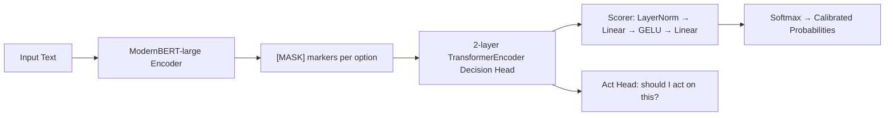
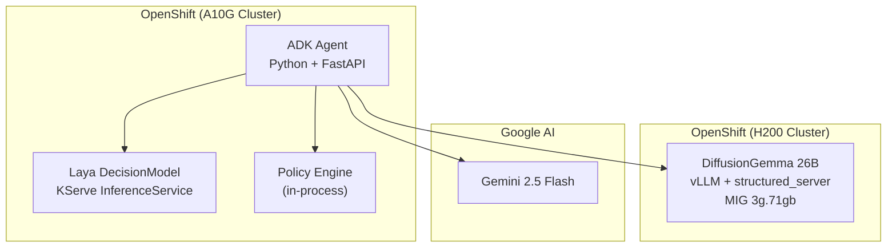

# Cross-Border Data Router

A three-tier AI agent for compliance-aware data routing in regulated industries.  
**System 1** (instant neural classification) + **System 2** (LLM reasoning) + **deterministic policy engine**.

## The Problem

Financial institutions processing data across borders face cascading regulatory requirements:

- **GDPR (EU)**: Personal data of EU residents cannot leave the EU/EEA without adequacy decisions or binding corporate rules.  Violations carry fines up to 4% of global annual revenue.
- **CCPA (US)**: California consumers can opt out of cross-border data sales.  Enforcement actions have reached eight-figure settlements.
- **Conflicting obligations**: A German customer's financial records may simultaneously require EU residency (GDPR), US reporting (SEC/FATCA), and contractual restrictions that forbid certain jurisdictions entirely.

Current approaches fail because they rely on either:
- **Manual classification** — slow, error-prone, doesn't scale to real-time transaction volumes.
- **LLM-only classification** — generative models hallucinate categories, produce uncalibrated confidence scores, and take seconds per request.

Neither provides the **auditable probability distributions** that compliance teams need to justify routing decisions to regulators.

## The Solution

This demo separates the problem into three tiers, each using the right tool:

```
┌──────────────────────────────────────────────────────────────────┐
│                  Gemini 2.5 Flash (System 2)                      │
│          "Reason about the routing decision"                      │
│          Google AI API — no on-cluster GPU needed                 │
└──────────────┬──────────────────────────┬────────────────────────┘
               │                          │
      ┌────────▼────────┐       ┌────────▼─────────┐
      │  Laya (Fast)    │       │ DiffusionGemma   │
      │  System 1a      │       │ System 1b        │
      │  421M encoder   │       │ 26B diffusion    │
      │  CPU, ~145ms    │       │ H200 MIG, ~10-26s│
      │  /v1/systemone  │       │ /v1/systemone    │
      └────────┬────────┘       └────────┬─────────┘
               │   Same Jev protocol     │
               └──────────┬──────────────┘
                          │
                  ┌───────▼───────┐
                  │ Policy Engine │
                  │ A2A + OpenEAGO│
                  │ Deterministic │
                  └───────┬───────┘
                          │
          ┌───────────────┼───────────────┐
          ▼               ▼               ▼
       EU Agent       UK Agent       US Agent
      (Frankfurt)    (London)       (Iowa)
```

| Component | Role | Hardware | Latency |
|---|---|---|---|
| **Laya** | System 1a — fast neural classification.  Purpose-built encoder that outputs calibrated probability distributions.  Cannot hallucinate. | CPU (or GPU) | ~145ms |
| **DiffusionGemma 26B** | System 1b — deep analysis.  Diffusion transformer with structured-read mode.  Denoises a fixed token canvas and reads the answer distribution. | H200 MIG 3g.71gb | ~10-26s |
| **Gemini 2.5 Flash** | System 2 — reasoning.  Interprets the System 1 classification, applies business rules, and decides which regional agent to route to. | Google AI API | ~1-3s |
| **Policy Engine** | Deterministic three-stage filter: data-residency → jurisdiction-exclusion → scoring.  Uses A2A Agent Cards with OpenEAGO geographic metadata. | CPU (in-process) | <1ms |

### Why two System 1 engines?

Both Laya and DiffusionGemma speak the **same Jev `/v1/systemone` wire protocol** — the agent calls a single tool and the backend is selected automatically:

- **`auto` mode** (default): Laya classifies in ~145ms.  If confidence < 80%, DiffusionGemma is also called for a deeper read.  Both results are returned.
- **`fast` mode**: Laya only — for latency-sensitive real-time routing.
- **`deep` mode**: DiffusionGemma only — for audit-grade analysis.

This mirrors a real operational pattern: **fast triage** for volume, **deep confirmation** for compliance evidence.

## What is the Jev Protocol?

Jev treats a model as a **decision function**, not a text generator.  Instead of asking "What type of data is this?" and parsing prose, Jev sends structured questions and gets back **typed answers with probabilities**:

```json
{
  "state": "Hans Mueller, Bahnhofstrasse 42, Berlin. Account DE89370400...",
  "questions": {
    "data_type": {
      "type": "choice",
      "instructions": "What type of sensitive data is present?",
      "options": ["PII", "financial", "health", "public"]
    },
    "has_pii": {
      "type": "noul",
      "instructions": "Does this record contain PII?"
    },
    "needs_human_review": {
      "type": "noul",
      "instructions": "Should a human compliance officer review this?"
    }
  }
}
```

Response:
```json
{
  "answers": {
    "data_type": {"choice": "PII", "probabilities": {"PII": 0.94, "financial": 0.04, "health": 0.01, "public": 0.01}},
    "has_pii":   {"noul": 0.97},
    "needs_human_review": {"noul": 0.23}
  }
}
```

Three question types:
- **`noul`** (yes/no): Returns a probability 0.0–1.0.  "Is this PII?" → 0.97.
- **`choice`** (categorical): Returns a distribution over options.  "What type?" → {PII: 0.94, financial: 0.04, ...}.
- **`score`** (ordered scale): Returns a distribution over levels.  "Risk tier?" → {low: 0.1, medium: 0.3, high: 0.6}.

The probabilities are **calibrated** — when Laya says 0.94, the true positive rate across similar inputs is approximately 94%.  This is what regulators want: not "the AI said PII", but "the AI assigned 94% probability to PII, which exceeds our 80% routing threshold."

## Architecture Details

### Laya DecisionModel

Laya is a 421M-parameter encoder that was purpose-built for decision tasks:



Key architectural choices:
- **MASK-marker probing**: Each answer option gets a `[MASK]` token.  The model scores all options in one bidirectional forward pass — no autoregressive generation.
- **Variable options at inference**: The number of choices can differ between requests without retraining.
- **RL training**: Trained with strictly proper scoring rules (log score + spherical score + ranked probability score) that incentivize calibrated distributions, not just correct labels.
- **Act head**: A separate head that answers "should I act on this at all?" — the abstention signal.

### DiffusionGemma 26B-A4B

DiffusionGemma is a 26B-parameter Mixture-of-Experts diffusion transformer (4B active parameters per token):

- **Structured-read mode**: vLLM pins an answer template on a fixed token canvas, denoises it in parallel, and reads the distribution at the answer slots.
- **Multi-sample averaging**: Each answer averages over multiple noise draws for stability.
- **Auto-sampling**: When entropy is high, additional reads are taken automatically.
- Deployed via the upstream `structured_server.py` as a sidecar to the vLLM engine.

### Policy Engine

The routing policy is a deterministic three-stage filter based on the [OpenEAGO](https://openeago.finos.org/) framework:

1. **Residency filter**: Eliminate any agent whose declared `data_residency_regions` doesn't cover all regions the request requires.
2. **Jurisdiction-exclusion filter**: Eliminate any agent whose jurisdiction is on the request's excluded list.
3. **Scoring**: Rank survivors by jurisdiction preference (70%) and compliance-tag overlap (30%).

Hard filters run before scoring and **never get overridden** — a non-compliant agent cannot out-score its way into eligibility.  If nothing survives, the request is rejected outright with an escalation recommendation.

Agent capabilities are declared via [A2A](https://github.com/google/A2A) `AgentCard` objects with OpenEAGO geographic metadata extensions.

### Infrastructure



## Demo Scenarios

### 1. EU PII — Fast Path (Laya only)

> "Classify and route: Hans Mueller, Bahnhofstrasse 42, Berlin. Date of birth 1985-03-15. Tax ID DE123456789."

- Laya classifies as **PII** with 94% confidence in ~145ms
- Policy engine routes to **EU Agent** (Frankfurt) — GDPR compliant
- No DiffusionGemma escalation needed (confidence > 80%)

### 2. Ambiguous Record — Auto-Escalation

> "Classify and route: Transaction ref TXN-2026-441. Amount: 5,200 EUR. Note: medical equipment purchase for patient care facility in Munich."

- Laya classifies as **financial** with 72% confidence — below 80% threshold
- DiffusionGemma is auto-called: confirms **financial** at 85%, also flags `has_pii: 0.31` and `needs_human_review: 0.67`
- Agent notes the dual classification and routes to EU Agent with a human-review recommendation

### 3. Cross-Border Conflict

> "Route this record: US-based bank account statement for a German national residing in France. Contains SSN, IBAN, and tax residency declarations. Must comply with both FATCA and GDPR. Cannot be processed in China or Russia."

- Laya classifies as **PII** with 91% confidence
- Policy engine applies GDPR → requires EU residency, excludes US
- But FATCA requires US reporting — **conflict detected**
- Policy rejects with escalation: "No agent satisfies both EU residency and US reporting. Escalate for human review."

### 4. Deep Analysis Mode

> "I need a thorough compliance analysis: Patient records from Berlin hospital, including diagnoses, treatment plans, and insurance claim IDs. Use deep analysis."

- Agent calls `classify_with_laya(text, backend="deep")` — explicitly requests DiffusionGemma
- DiffusionGemma returns: `health: 0.91, PII: 0.87, needs_human_review: 0.82`
- Agent recommends EU routing with mandatory human review (health + PII combined)

## Setup

### Prerequisites

- Python 3.11+
- [uv](https://docs.astral.sh/uv/) for dependency management
- A [Gemini API key](https://aistudio.google.com/apikey)
- Access to Laya and DiffusionGemma endpoints (or run with `SYSTEM1_MODE=fast` for Laya only)

### Local Development

```bash
cd agent
cp .env.example .env
# Edit .env — set GOOGLE_API_KEY to your Gemini key
uv sync
source .venv/bin/activate
uv run adk web .   # Opens ADK playground at http://localhost:8000
```

### OpenShift Deployment

```bash
# 1. Create secrets
oc create secret generic gemini-apikey -n laya-demo \
  --from-literal=api_key=<YOUR_GEMINI_KEY>

# 2. Build the agent image
oc new-build --binary --name=cbdr-agent -n laya-demo
cd agent && oc start-build cbdr-agent --from-dir=. -n laya-demo --follow

# 3. Deploy
oc apply -f manifests/06-agent.yaml
```

### DiffusionGemma on H200 MIG

```bash
# Prerequisites: booked MIG 3g.71gb slot, HuggingFace token

# 1. Create secrets
oc create secret generic hf-token -n user-rbanda \
  --from-literal=HF_TOKEN=<YOUR_HF_TOKEN>
oc create configmap dgemma-structured-server -n user-rbanda \
  --from-file=structured_server.py=manifests/structured_server.py

# 2. Deploy
oc apply -f manifests/07-diffusiongemma.yaml
```

## Project Structure

```
laya-rhoai-demo/
├── agent/                      # ADK agent application
│   ├── app/
│   │   ├── agent.py            # Root agent with dual System 1 + policy tools
│   │   ├── model.py            # Gemini model configuration
│   │   ├── prompt.py           # Orchestrator instructions
│   │   ├── policy/             # Deterministic routing engine
│   │   │   ├── cards.py        # A2A Agent Cards with OpenEAGO metadata
│   │   │   ├── engine.py       # Three-stage routing policy
│   │   │   └── models.py       # Data shapes (DataRequest, RoutingDecision)
│   │   ├── sub_agents/         # Regional processor agents (EU, UK, US)
│   │   └── tools/
│   │       ├── laya_tool.py    # Dual-backend Jev System 1 tool
│   │       └── routing_tool.py # Policy engine tool wrapper
│   ├── playground/             # Chat UI
│   ├── tests/
│   ├── Dockerfile
│   └── pyproject.toml
├── manifests/
│   ├── 00-namespace.yaml       # laya-demo namespace
│   ├── 01-pvcs.yaml            # Model storage
│   ├── 02-build.yaml           # OpenShift BuildConfig
│   ├── 03-serving-runtimes.yaml # KServe vLLM runtimes
│   ├── 04-inference-services.yaml # Laya InferenceService
│   ├── 05-routes.yaml          # External routes
│   ├── 06-agent.yaml           # Agent Deployment + Service + Route
│   └── 07-diffusiongemma.yaml  # DiffusionGemma on H200 MIG
└── README.md
```

## RHOAI Features Used

| Feature | How it's used |
|---|---|
| **KServe InferenceService** | Serves Laya DecisionModel with RawDeployment mode and custom ServingRuntime |
| **NVIDIA GPU Operator** | Manages A10G GPUs for Laya inference |
| **MIG Partitioning** | H200 MIG 3g.71gb slice for DiffusionGemma |
| **Kueue** | GPU workload admission with booking-based quotas |
| **OpenShift BuildConfig** | Binary Docker builds for the agent container |
| **Routes** | TLS-terminated external access to all endpoints |

## License

Apache 2.0 — see [LICENSE](LICENSE).
